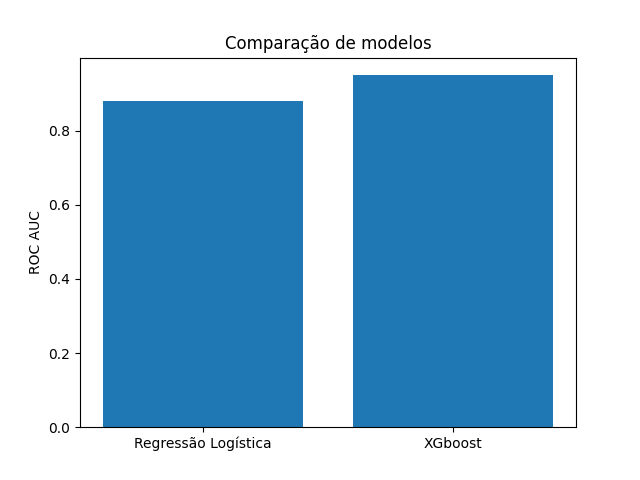
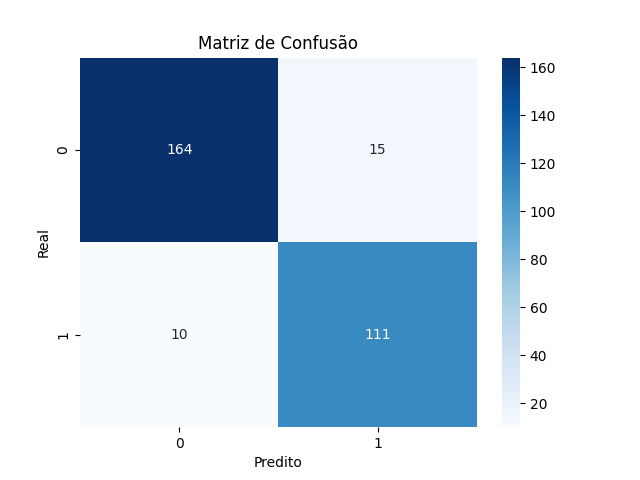
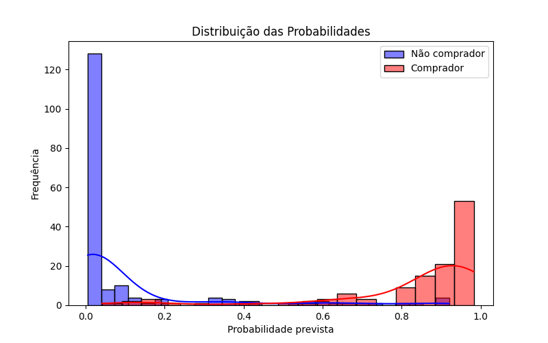
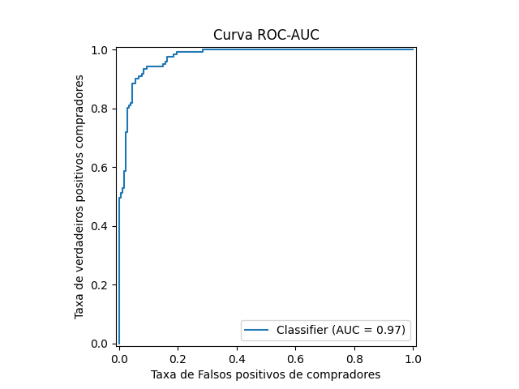
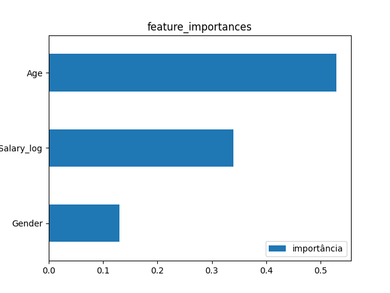

# 🚗 Modelo de Previsão de Leads Propensos à Compra de Veículos

---

## 📌 Contexto de Negócio

Empresas do setor automobilístico lidam diariamente com grandes volumes de leads, mas nem todos possuem real potencial de conversão. Direcionar esforços comerciais de forma eficiente é essencial para aumentar o faturamento e reduzir desperdício de recursos.

---

## 🎯 Objetivo

Desenvolver um modelo de Machine Learning capaz de identificar clientes com maior probabilidade de realizar a compra de um veículo, auxiliando o time de negócios na priorização de leads mais qualificados.

---

## 📊 Dataset

O conjunto de dados contém informações de clientes, incluindo:

* Idade (`Age`)
* Renda anual (`AnnualSalary`)
* Gênero (`Gender`)
* Variável target (`Purchased`):

  * 0 → Não comprou
  * 1 → Comprou

---

## 🧠 Metodologia

O projeto seguiu um pipeline completo de ciência de dados:

1. **Carregamento e tratamento dos dados**
2. **Análise exploratória (EDA)**
3. **Pré-processamento**

   * Transformação logarítmica da renda
   * Padronização de variáveis numéricas
4. **Separação treino/teste com estratificação**
5. **Treinamento de modelos**
6. **Validação cruzada (Cross Validation)**
7. **Otimização de hiperparâmetros (RandomizedSearchCV)**
8. **Avaliação final em dados não vistos (test set)**

---

## 🤖 Modelagem

Foram testados dois modelos principais:

* Regressão Logística (baseline)
* XGBoost (modelo avançado)

O XGBoost foi selecionado por apresentar melhor performance e maior capacidade de generalização.



---

## 📈 Resultados

### 🔹 Métrica principal: ROC AUC

* Baseline (Regressão Logística): ~0.88
* XGBoost: ~0.95
* XGBoost Tunado (Teste): **0.9749**

---

### 🔹 Classification Report (Teste)

* Recall (compradores): **0.92**
* Precision (compradores): **0.88**
* F1-score: **0.90**



---

## 📊 Interpretação de Negócio



O modelo demonstrou alta capacidade de identificar clientes com potencial de compra:

* Captura aproximadamente **92% dos compradores reais**
* Mantém boa precisão (**88%**), reduzindo abordagens desnecessárias



### 📊 Importância das variáveis



analisando globalmente, a feature mais importante para o modelo permanece "Age", a variável que indicou 

maior correlação positiva na matriz de correlação linear,

o modelo considera que quanto maior a idade dos indivíduos, mais propensos a comprar veículos.

### 💡 Trade-off

O modelo prioriza **recall alto**, o que significa:

* Mais oportunidades de venda capturadas
* Possível aumento no esforço do time comercial

Esse comportamento é adequado para cenários onde perder um cliente potencial é mais custoso do que abordar um lead com menor probabilidade.


---

## 🧰 Tecnologias Utilizadas

* Python
* Pandas
* NumPy
* Scikit-learn
* XGBoost
* Matplotlib / Seaborn

---

## 📁 Estrutura do Projeto

```bash
src/
├── data/
│   ├── load_data.py
│   └── split_data.py
├── features/
│   ├── build_features.py
│   └── preprocess.py
├── models/
│   ├── train_baseline.py
│   ├── train_xgboost.py
│   ├── tune_xgboost.py
│   └── compare_models.py

notebook/
base/
imagens/
```

---

## 📌 Conclusão

O modelo desenvolvido apresentou excelente desempenho e potencial para aplicação real em estratégias comerciais, permitindo maior eficiência na priorização de leads e aumento da taxa de conversão.

---

## 🚀 Próximos Passos

* Deploy do modelo
* Integração com CRM
* Monitoramento de performance em produção
* Re-treinamento com novos dados

---
